# Entrando

A>*"Às vezes, é necessário alguém de fora. Com um olhar fresco para ver a verdade."*
A>
A>― Ally Carter, *Ladrões de Elite* (Heist Society)

Uma vez que conseguimos adentrar no mundo dos dados, precisamos, agora, conhecer o caminho que estamos cruzando. Afinal, não queremos perder nem um segundo a mais!

Por isso, é importante ter em mente  que cada conjunto tem algo a nos dizer. Dentro de tantas possibilidades, segue uma lista com os temas mais frequentes de encontrar, sendo que alguns vão exigir mais trabalho do que outros.

1. **Entre sucessos e fracassos**: *quem está no topo?*
2. **O que está por trás dos números** — *aquilo que os dados dizem sobre nós enquanto país, indústria ou região?*
3. **Inesperado**: *o que muda no dado conforme o tempo ou lugar — e por quê isso acontece?
4. **Desmascarar ou não**: *os dados apoiam as afirmações feitas por políticos ou especialistas?*
5. **Tendência**: *o que está em alta?*
6. **Possíveis desigualdades**: *pessoas em diferentes lugares possuem as mesmas condições básicas de vida?*
7. **"Analisando as estatísticas"**: *os dados são confiáveis, completos? Ou existe alguém tentando ocultá-los?
8. **Vítimas, vencedores e perdedores**: *quais são os impactos dos dados  — as histórias humanizadas? *
9. **As coisas acontecem juntas**: *uma coisa sobe quando a outra também o faz? Ou uma coisa desce enquanto outra sobe e vice-versa? Note que isso não significa causalidade.*
10. **"Fiscalizar"**: *se, no passado, alguém provocou uma mudança em relação a como as coisas eram feitas, isso gerou o impacto planejado?*

Q>### Quais matérias nossos dados sobre gastos podem gerar? E o quão rápido podemos desenvolvê-las?
Q>
Q>Para começar, busque investir cinco minutos examinando sua base de informações e anotando as ideias que surgirem. Obviamente, esse conjunto pode não responder sozinho todas as suas perguntas — mas você pode direcioná-lo a fazer isso.

Por diversas vezes você vai se pegar distraído com as várias possibilidades que o seu conjunto te oferecerá — mas manter o foco é importante, principalmente se você estiver trabalhando sob um prazo. Portanto, em relação aos nossos dados sobre despesas, vamos, neste livro, voltar a atenção para um dos assuntos mais simples de se abordar: quem é o maior beneficiário desse dinheiro?

## Alavanca do jornalismo de dados: as tabelas dinâmicas

O caminho mais rápido de 'quebrar' nossa base de informações e ter bom panorama dela é por meio das **tabelas dinâmicas**.

Pois, essa ferramenta pode *agregar* números em nossos dados para nós podermos, por exemplo, combinar todos os pagamentos de uma empresa e ver o *total* arrecadado — em vez de apenas aqueles feitos *individualmente*(o que temos agora). Ou ainda, aplicando a ideia aos pagamentos realizados por departamento, ver qual gastou mais dinheiro no total. As tabelas dinâmicas também são úteis na "contagem" — para descobrirmos *quantos* pagamentos foram feitos a uma empresa, a quantidade delas e qual departamento fez mais.

Desse modo, antes de começarmos a criar uma tabela dinâmica, *você deve ter certeza de que selecionou apenas uma das células em seu conjunto de dados* — não mais do que isso. Apenas clique em *uma*!

Assim, o próximo passo é, encontrar a opção de tabela dinâmica no Excel, procurando na parte superior da tela junto de **Arquivo**, **Editar**, **Visualizar**, etc. Ela costuma aparecer, também, em **Dados**. Mas, em outros casos, você pode achá-la em **Inserir**. Portanto, isso pode mudar conforme a versão que você tem no seu computador, basta explorar. Porém, se você mesmo assim não conseguir achá-la, use **Ajuda** no menu e pesquise por 'dinâmica'.

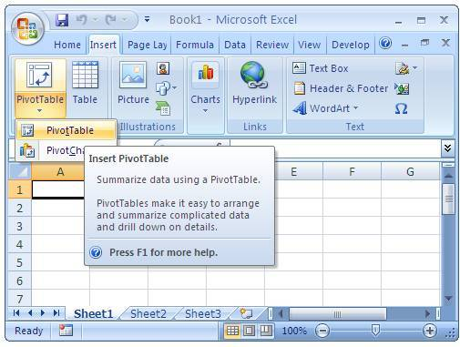

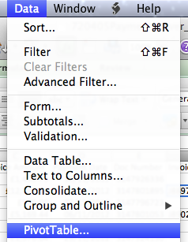

Agora que você localizou essa ferramenta, selecione-a e uma nova janela vai surgir para verificar se o Excel entendeu corretamente onde o seu dado está (e é por isso que você precisava ter certeza de que estava *em algum lugar nos seus dados originais* antes de começar). A partir daí, o Excel, automaticamente, vai detectar as margens dos seus números. Em outras palavras, onde atinge uma coluna ou linha vazia, será considerado o limite das células de seu conjunto.

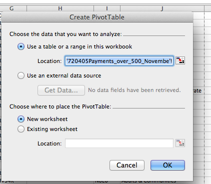

Agora, o próximo passo é conferir se o computador de fato acertou a localização dos seus dados. Mas, se isso estiver errado, comece novamente. Certo de que você está com apenas uma célula selecionada (*não pressione as teclas do cursor enquanto você ainda estiver na nova janela* — confie em mim). Feito isso, clique em *OK*.

O que acontecer agora vai depender da sua versão de Excel. No geral, você deve conseguir ver uma tabela dinâmica *vazia* com as seguintes divisões:
 
* Uma área dizendo '**Valores**'
* Outra,'**Linha**'
* E uma com '**Coluna**'

Abaixo, seguem imagens que mostram três formas mais comuns dessas opções aparecerem (se você tiver um jeito diferente de chegar a esse resultado, por favor, entre em contato comigo para  eu poder atualizar o livro).

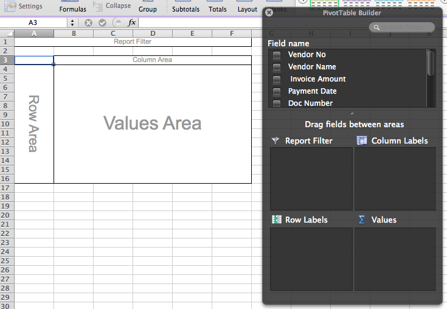

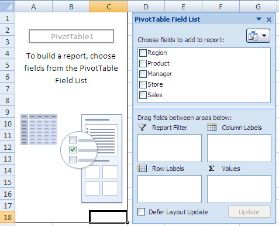

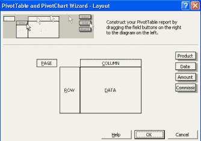

Entretanto, independente disso, o próximo passo será o mesmo: arrastar os assuntos da sua matéria para essas categorias. A primeira caixa tem o foco nas *Linhas* e são elas que vão tratar do *sujeito* da sua notícia...

… Portanto, sobre quem poderíamos fazer uma matéria?

## Quem o nosso protagonista pode ser?

Se você tem um conjunto de dados, uma boa ideia é explorar as possibilidades que essas informações fornecem sobre determinado assunto.

Se tratando do protagonista de nossa matéria:

* **Números de uma fatura**? Provavelmente não — embora eles fossem únicos, ainda assim é possível encontrar situações em que eles não são.
* **Empresas**? Sim: 'a empresa X recebeu R$Ym', ou 'as empresas do tipo B receberam R$Am'.
* **Número do fornecedor**? Se nós temos nomes de empresas, vamos dar preferência a eles em muitas circunstâncias. Porém, numa situação em que o nome dela não for dado, o número do fornecedor pode nos ajudar a encontrá-lo.
* **Quantidades**? Talvez: 'um pagamento X ultrapassa R$1m' — mas isso é provável ser "o quê" no lead da nossa matéria.
* **Datas**? Pode haver circunstâncias em que o fato é contado em datas: por exemplo, um setor gastou uma quantia excessiva em dinheiro numa época desfavorável? Ou começaram a enxugar os gastos somente quando o dinheiro acabou por conta do mau gerenciamento — e quais os impactos disso? É possível criar uma matéria sobre despesas ao longo do tempo, mas isso retorna ao que foi visto em *quantidades*. Portanto, as datas poderiam ser “o quê” novamente.
* **Departamento Financeiro**? Sim. Essa é a parte responsável por realizar pagamentos dentro de uma empresa. Desse modo, 'O departamento de Y gastou R$X' é uma história bastante provável para o seu texto.
* **Centro de custo**? Por agora não — mas em determinadas circunstâncias é possível obter algo mais preciso como 'Centro de custo Y gastou R$X'.

De acordo com as opções acima, vamos limitar nossas escolhas a dois fortes candidatos para protagonizar a nossa matéria: as empresas e seus setores.

Nisso, vamos arrastar a caixa das **empresas** até a área **Linhas** (mesmo que você tenha mais de uma caixa, tente com apenas uma e veja o que acontece — às vezes existem outros modos de se fazer a mesma coisa, e você sempre poderá tentar outro método na próxima vez). Agora, você pode atualizar a sua tabela dinâmica para ver uma lista de todas as empresas em dados.

Mas nós estamos sob um prazo! Então precisamos ser rápidos e seguir em frente.

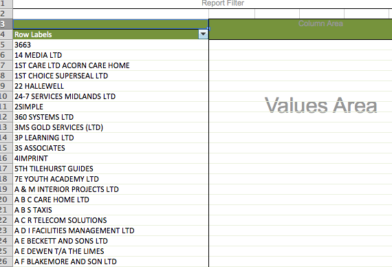

## E sobre *o quê* vamos escrever?

Este é o próximo passo no desenvolvimento do nosso lead. Na verdade, isto até que está bem óbvio: muitos dos exemplos que vimos anteriormente se referem a gastos ou recebimento em **dinheiro**. A partir daí, somos capazes de definir nosso 'o quê’, representado aqui pelas **Quantidades**- logo, estes devem ser arrastados para a área de **Valores**.

Agora, basta atualizar a tabela mais uma vez para perceber que apareceram, à direita da nossa lista de empresas, os pagamentos feitos a elas.

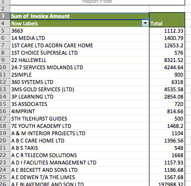

Particularmente, a maneira que as quantidades serão contadas vai depender de como os dados vão ser interpretados. Em muitos casos,o Excel ou o Google Sheets, ao perceberem esses números, entenderão que você quer uni-los. Portanto, eles vão aplicar a opção SOMA. Se isso tiver acontecido, na sua caixa de valores estará indicado o ‘Total Geral’.

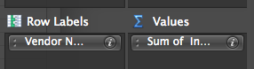

Algumas vezes, porém — quando os dados não forem numéricos — o computador pode entender que você deseja *contá-los*, por meio de uma função chamada... (que rufem os tambores)...CONTAGEM! Se isso acontecer, a sua caixa de valores mostrará 'CONTAGEM + o nome da fonte’.

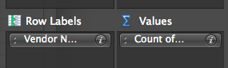

### Mudando os cálculos

Entretanto, se a sua tabela dinâmica está contando e você deseja mudar a função para fazer um cálculo diferente, clique com o botão direito na área que consta 'Total Geral'. Selecionando 'Configurações do Campo de Valor’(se você usa Mac você só precisa clicar no ícone 'i' naquela área).

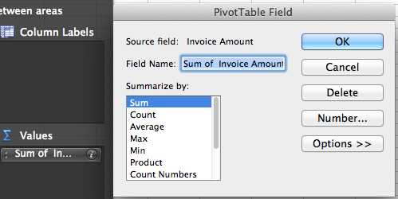

Uma nova janela vai aparecer com duas áreas:

*À esquerda, abaixo de *Resumir Valores por:*, estão as alternativas de agregar valores por SOMA, CONTAGEM, MÉDIA, etc. Há, também, como mostrar apenas o maior ou menor valor (por exemplo, o maior ou menor pagamento individual) para  cada linha; indicados por MÁXIMO e MÍNIMO. Caso, você não tenha conseguido ver a SOMA, certifique-se de que você rolou para cima.

*Adiante, o botão 'Formato do Número' permite que você mude a forma como um determinado valor surgirá. Exemplificando: se você estiver lidando com dinheiro, você pode escolher a opção 'moeda' que vai adicionar um símbolo monetário e vários separadores. Ou seja, a figura 1000000 se tornará R$1,000,000 — algo mais simples de entender.

Não se esqueça de que, sempre que você escolher aquilo que deseja aparecer, clique em **OK** de modo que a tabela dinâmica seja atualizada.

A>### E as colunas?
A>
A>Provavelmente, você se sentirá tentado a adicionar mais algumas colunas à sua tabela dinâmica. Porém, na maioria dos casos, isso pode complicar tudo a ponto de torná-la extremamente confusa.
Do contrário, opte por criar uma tabela dinâmica para ver o que você deseja adicionar como coluna — ou use o filtro de relatório para alternar entre os diferentes elementos (explicarei essa parte melhor adiante).
A>
A>Exceto se você adicionar uma coluna baseada num campo em que seus dados são restritos a algumas opções. Como, por exemplo, 'Sim' ou 'Não', 'Homem' ou 'Mulher'; ou números de classificação como 1,2,3,4 e 5.
A>
A>### Trabalhando com colunas em uma tabela dinâmica — e visualizando as porcentagens das linhas.
A>
A>Se o seu caso for justamente esse, com dados que vão funcionar com as colunas, você pode fazer com que a sua tabela dinâmica exiba os resultados como porcentagens ao invés de números inteiros.
A>
A>Para isso, na janela 'Configurações do Campo de Valor’' clique no botão à direita **Mostrar Valores como:**
A>
A>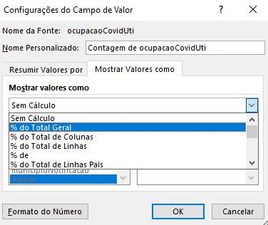
A>
A>Aqui, o menu permitirá que você especifique a forma em que os números vão aparecer. Assim, **% da linha** vai mostrar seus valores não como números inteiros (pagamentos, inspeções, ou a quantidade de dinheiro), e sim  como porcentagem daquela linha (por exemplo, a proporção de todas aquelas inspeções ou a porcentagem dos pagamentos da empresa).
A>
A>Do mesmo modo, **% da coluna** vai mostrar o que o valor de cada célula representa como uma proporção da coluna em que se encontra. E **% do total** te mostrará exatamente a porcentagem da linha Total Geral.
A>
A>Também existem outras ferramentas mais complexas que vão te permitir exibir as quantias em  porcentagem. Como a diferença de outro valor, ou outra categoria específica.
A>
A> 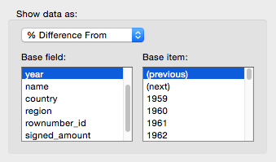
A>
A>Ainda, **Soma Acumulada em** mostrará os valores aumentando ou diminuindo a depender da área que você selecionar. Assim, escolhendo um 'ano' específico, por exemplo, a tabela vai indicar que o valor de cada ano irá corresponder ao total daquele ano mais os valores antecedentes.
Portanto, escolher uma categoria específica significa que as quantidades crescerão à medida que aparecerem na linha. Nisso, a última categoria nas linhas da sua tabela dinâmica vai mostrar o total de *todas* as anteriores.
A>
A>Caso você precise de alguns vídeos para entender melhor estas técnicas, [assista as este tutorial](http://www.contextures.com/xlPivot10.html#PctDiffFrom).

### A cereja do bolo

Até o momento, os dados foram organizados por linhas — empresas listadas em ordem alfabética. Mas, às vezes, esse pode não ser o melhor caminho a seguir.

Nesses casos, em que será preciso classificar as  informações com outros critérios, você terá que selecionar alguma célula desse tipo de coluna e clicar em **Dados>Classificar*. Seguido pela forma que você deseja classificar os seus dados. Feito isso, basta clicar em *OK*. 
Outra maneira de fazer isto é por meio das opções botões Z-A ou A-Z que costumam ficar ao lado de ‘Classificar’. Em alguns casos, você pode precisar escolher a coluna que vai classificar por um menu suspenso.

Imediatamente, você verá quem são os dez maiores destinatários do dinheiro (ou um número além ): certos nomes serão óbvios, já outros vão exigir uma pesquisa rápida (às vezes, até mesmo uma ligação caso as dúvidas persistirem).

Você pode se guiar pelas seguintes ideias  na escrita do seu texto, conforme o que estiver buscando:

*Milhões estão sendo pagos todo mês em condições iguais de acordo?
*Para escrever um perfil: quais os maiores projetos de construção da região?
*A terceirização de serviços deixa uma grande quantia em dinheiro restritos à fiscalização pública?
*Quais as consequências de um pedido feito pela administração para um corte nas contas de energia?

Portanto, investir um tempo lendo matérias similares não só ajuda no desenvolvimento dessas sugestões, como também te torna familiarizado com determinado tipo de matéria. Além disso, pesquisar por estes nomes de empresas é extremamente positivo. Pois, traz relatórios antecedentes envolvendo-as, permitindo com que você reavalie pontos de vista e traga novos ângulos para o seu texto.

Existem, ainda, muitas outras possibilidades que podem vir a mente ao passo em que você continuar examinando sua tabela. O interessante é que você não ignore as empresas com os menores valores — às vezes, elas podem incluir algumas peculiaridades que você pode abordar em ocasiões futuras  (pessoalmente, meu achado favorito foi uma empresa de aluguel de frango), ou ainda levantar questões diferentes.

Segue uma lista com algumas sugestões que você pode considerar, e adaptar de acordo com o conteúdo da tabela, enquanto explora os seus dados:

*Qual é a quantia investida em casas de cuidado? Quem é o maior beneficiário? E quanto às empresas desse ramo com algum passado obscuro? — você pode fazer as mesmas perguntas em relação aos lares infantis.
*Quanto é gasto pelas agências com um quadro de funcionários temporário? Por que ocorrem contratações enquanto os colaboradores temporários estão sendo despedidos?
*Existem diversas instituições beneficentes. O quão grande é o papel desses órgãos em prover serviços públicos? Elas correm risco de sofrerem algum tipo de corte?
*Existem grandes pagamentos feitos à órgãos esportivos como a Federação Britânica de Ciclismo (British Cycling Federation) e a Associação dos Tenistas (Lawn Tennis Association) — isto serve para quê? (Um lead parecido é encontrado [essa notícia da primeira página do Manchester Evening News](http://www.manchestereveningnews.co.uk/news/greater-manchester-news/you-splash-out-300k-australian-4033385) — na imagem abaixo).
*Existem pagamentos direcionados a outros setores — por quê?
*Quanto está sendo gasto em transporte? E para quem esse dinheiro é destinado?
*Há alguns B&B Hotels na tabela que custam dezenas de milhares de reais — para quê? (Aquele gasto foi a fonte [dessa notícia na primeira página do Birmingham Post](http://www.birminghammail.co.uk/news/local-news/city-council-spends-nearly-1m-1330817) — veja a segunda imagem abaixo).
*Por que tanto dinheiro está sendo gasto em Starbucks? Ou ainda, qual o motivo por trás de um aluguel acima de £1000 de um Jaguar?

Além disso:

*Dados pessoais editados — do que se trata?

Você vai reparar que muitos desses temas não exigem mais trabalho com dados — nesse caso, é hora de **fazer a sua apuração e começar a entrar em contato com as fontes**. Se este for o seu caso, já pode pular para o último capítulo.

Infelizmente, outros trabalhos vão ser sobre mais de uma empresa e, se este é o seu caso, o trabalho não acabou. Portanto, para prosseguirmos, uma segunda técnica vai ser necessária.

I>### Cálculos para um contexto
I>
I>Colocar a sua história num contexto, pode exigir de você elementos como o ‘total geral’ ou o ‘valor do pagamento’ médio. Nisso, para conseguir estes resultados, você deve localizar uma coluna *vazia* e digitar uma das fórmulas a seguir em qualquer célula. Substituindo 'D:D' com a letra da coluna contendo os valores que você quer calcular:
I>
I>*'=SOMA(D:D)'
I>*'=MÉDIA(D:D)'
I>
I>(É simples: para encontrar o total de todos os valores na coluna A, mude a fórmula para '=SOMA(A:A)'. E, se você quiser a média dos pagamentos da coluna C, mude a fórmula para '=MÉDIA(C:C)').

T>### Mantenha o foco: o mantra do jornalismo de dados!
T>
T>Em meio há tantas possibilidades é fácil se distrair com essas diferentes vias de direção. Por isso mesmo, adicionar colunas à sua tabela dinâmica tornaria tudo muito complicado de interpretar. Lembre-se que nós precisamos ser rápidos - portanto, simplifique as coisas ao máximo! Afinal, estamos tratando de um roubo...

## A utilidade dos filtros avançados

Caso você queira um panorama de várias empresas diferentes — como os lares de idosos, empresas de transporte e companhias com quadros temporários de funcionários que vimos anteriormente — será necessário agrupá-las de alguma forma.

E um bom jeito de fazer isso é usando os **filtros avançados** para encontrar pagamentos que possuam uma característica em comum — como companhias com a palavra ‘táxi’ no nome. Esse recurso é um dos dois tipos de filtros usados em Excel, sendo que o outro é o **filtro automático** que é simples de aplicar: apenas selecione **Dados>Filtrar**, por fim, clique no menu suspenso que vai aparecer na parte superior de cada coluna.

Nesse menu você pode escolher as empresas que quiser filtrar, selecionando a coluna 'Nome do vendedor' e desmarcando 'Selecionar Tudo'. A partir daí, é só rolar para baixo e marcar os nomes desejados. Indo por um caminho mais fácil, em vez de rolar para baixo você pode usar a caixa de pesquisa no menu suspenso e encontrar empresas que contenham o termo que você está procurando (algumas versões em Excel vão selecioná-las automaticamente).

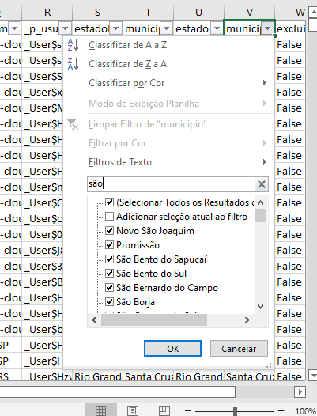

De fato, essa última opção é muito atraente. Porém, é provável que, ainda assim, você precise de um controle maior sobre seu  filtro e é aqui que você vai torná-lo avançado.

### Criando um filtro avançado

Para isso, você vai ter que criar separadamente uma 'mini tabela' mostrando quais são as categorias e termos que pretende filtrar. Ela precisa de:

*ter ao menos uma coluna vazia entre ela e seus dados principais.
*usar exatamente o(s) mesmo(s) título(s) de coluna daquelas com as informações que você quer.

Segue abaixo um exemplo, dos mais básicos, de 'mini tabela' para um filtro avançado com apenas um critério:

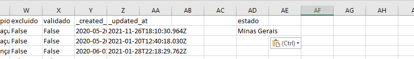

É importante notar os pontos a seguir:

*Os dados originais estão em colunas de A-H, dessa forma a próxima coluna 'I' foi **deixada vazia**. Isso faz com que o Excel não confunda a nova tabela (na coluna J) com a sua base original.
*E essa nova tabela tem o mesmo cabeçalho que a coluna que queremos filtrar: 'Nome do Vendedor' (‘Vendor Name’). Opte por **copiar e colar este título dos dados originais** para um resultado mais certeiro — assim, 'Nome do vendedor' não funcionaria por que tem um 'v' minúsculo. Portanto, espaços duplos e/ou antes e após os títulos das colunas podem causar problemas parecidos.
*Abaixo dos nomes daquela coluna, nós temos uma entrada: 'ELMDON CARS (TAXIS) LTD' — novamente, isso foi copiado e colado dos dados originais porque os filtros avançados apenas trarão de volta as **combinações exatas** — a menos que você use caracteres especiais, coisa que veremos à frente.

Vamos fazer um teste: **crie uma mini tabela semelhante em sua própria planilha** — lembrando de deixar uma coluna vazia além de copiar e colar o título da coluna e a célula que vai servir de critério na sua filtragem. Agora, você está pronto para usar a ferramenta. Mas antes disso...

**Certifique-se de que o cursor está em algum lugar no conjunto original**. Pois, assim como nas tabelas dinâmicas, o Excel busca adivinhar qual informação você quer filtrar — e, com certeza, queremos extrair os números originais e não os da nova mini tabela. Logo, você já pode selecionar o **Filtro avançado** que, como o automático, estará normalmente abaixo do menu em **Dados**.

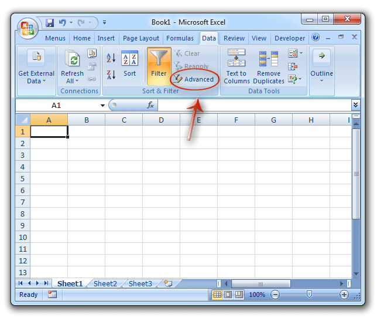

Uma nova janela vai aparecer com algumas opções. A partir daí, procure a caixa **Intervalo da lista**, nela você verá um conjunto das células que vai poder filtrar: algo semelhante à `$A$1:$H$16283`. Ignore os símbolos de dólar, eles estão ali para garantir a localização das células impedindo que sejam alteradas. Mostrando que os dados da célula A1 (coluna A, linha 1) até a célula H16283 (coluna H, linha 16283) estão sendo selecionados. Caso a sua planilha tenha mais linhas ou colunas, a segunda referência de célula será diferente — mas o princípio é o mesmo.

Vale ressaltar que, quando a janela aparecer, uma linha pontilhada também vai surgir envolvendo os dados originais (assim como acontece na criação de uma tabela dinâmica). Novamente, para você ver as margens dos dados que o Excel supõe que você queira filtrar.

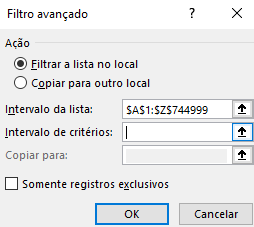

Abaixo, temos o campo intitulado **Intervalo de critérios:** — aqui, você vai introduzir o Excel à sua mini tabela. Adicionando os parâmetros que você deseja, nisso clique na sua mini tabela e arraste de um lado para o outro, selecionando-a totalmente. Caso necessário, você pode mover a janela do Fitro Avançado primeiro. Clicando no topo e arrastando para o lado.

Esqueça das outras opções que aparecerem nesta janela e não se preocupe em checar isso. Inclusive, evite usar as teclas de seta a fim de tentar ver o final da sequência — correndo o risco de mover o cursor para a planilha imediatamente. Aqui, o ponto principal é que **uma linha tracejada vai surgir ao redor dos dados que você escolheu** indicando que eles foram selecionados.

Basta, clicar em **OK** e ver os resultados do seu filtro avançado aparecerem. Neste exemplo, eu tenho quatro fileiras, mas você pode ter mais. Note que o número das fileiras, porém, não segue uma sequência:

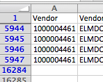

Isto acontece porque o filtro somente *oculta* aqueles que não forem correspondentes. Da mesma forma, a mini tabela desapareceu — com exceção dos títulos da coluna (e isso é importante como veremos a seguir).

Obviamente, nós poderíamos ter feito tudo de forma muito mais rápida utilizando um filtro automático. Mas essa foi apenas uma simulação — agora, vamos de fato experimentar o poder dos filtros avançados.

## Curingas do jornalismo de dados

Anteriormente, eu disse que você precisaria de um critério para ter uma **combinação perfeita** com os nomes de empresas nos seus dados — a menos que usássemos caracteres especiais. Estes, por sua vez, são chamados **curingas**, já que possuem o papel semelhante ao dessas cartas num jogo de baralho: eles podem representar qualquer outro personagem.

Os dois caracteres curingas do Excel são:

*um asterisco: '*' que substitui 'nenhum ou qualquer caractere'
*e o ponto de interrogação: '?' que substitui 'qualquer caractere *sozinho*'

É uma diferença sutil, mas importante como ainda veremos.

Tais símbolos nos permitem ser mais abertos em nossos critérios. Por exemplo, em vez de saber exatamente o nome de uma empresa, nós podemos colocar na mini tabela o seguinte:

'*TAXI*'

Desse modo, na filtragem, traremos de volta as linhas onde o campo 'Nome do Vendedor' conter *nenhum ou qualquer um dos caracteres* seguidos pelas letras T,A,X,I, seguido por *nenhum ou qualquer caractere*.

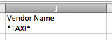

Em outras palavras, isso vai corresponder a qualquer empresa com as letras T,A,X,I, nessa ordem.

Pondo estes símbolos à parte, o importante a notar agora é que: 'Bob's Taxidermist' poderia ser pego por estes mesmos padrões (nós vamos lidar com a exclusão desses resultados mais tarde).

Novamente, teríamos um resultado parecido utilizando um filtro automático. O grande diferencial aqui é que sua versão avançada nos permite executar a tarefa com *múltiplos critérios*. Portanto, além de '*TAXI*' nós podemos adicionar:

'*TRANSPORT*'

'*CAR*'

'*HIRE*'

'*BUS*'

...entre outras palavras-chave que você pode esperar ver em nomes de empresas de táxi.

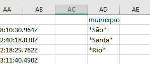

Agora, use novamente o filtro avançado (lembre de limpá-lo antes) e siga a sequência **Dados>Avançado** sem esquecer de, primeiro, pôr o seu cursor no conjunto original e especificar o intervalo dos critérios mais uma vez. Afinal, o espaço de células é maior que antes (no exemplo acima, sete células ao invés de duas).

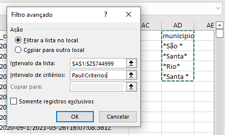

Por fim, você vai obter milhares de resultados — incluindo vários irrelevantes. E por quê isso? Bem, o nosso critério '*CAR*' está combinando com palavras como 'CARE' (então, todos os asilos serão incluídos) e '*HIRE*' está combinando com palavras como 'YORKSHIRE'. Para diminuir as chances disso acontecer, nós precisamos adicionar somente um caractere em nossos critérios: **o espaço**.

É fácil omiti-los em nomes de empresas e outros dados, mas os computadores os enxergam como personagens iguais a qualquer outro. E, de fato, eles são imensamente úteis na filtragem. Repare a diferença:

* '*CAR*'
* '*CAR *'

Aqui, a primeira opção vai combinar com 'CAR HIRE' *e* 'CARE HOME'. Porém, o segundo não vai corresponder a 'CARE HOME', pois ele está procurando por um espaço após o R. Pelo mesmo motivo, ele não vai combinar com 'HIRE CARS' e, para chegar a esse resultado, você precisaria adicionar outro critério: '*CARS*'. Mudando um pouco o exemplo, vamos aplicar esse mesmo princípio para '*HIRE*' — agora, colocando um espaço antes da palavra:

'* HIRE*'

Faremos desse modo por dois motivos:

*A palavra 'YORKSHIRE' e outros nomes de condados teriam um espaço depois deles de qualquer forma.
*Nomes reais das empresas de locação provavelmente terão os caracteres 'HIRE' no final, *sem* qualquer espaço depois deles e sim antes: por exemplo 'CAR HIRE'.

Sendo assim, opte por buscar padrões em seus dados durante a filtragem. Por exemplo: como você excluiria todos os resultados em nomes de empresas que correspondem à palavra 'BUS' usando a palavra 'BUSINESS'?

Portanto, sempre limpe o seu filtro, faça todas as mudanças necessárias nos critérios de sua mini tabela e volte a aplicar o filtro avançado.

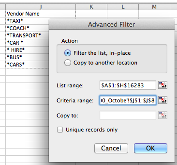

Nessa fase, você ainda vai cometer alguns erros — entretanto, eles já não dominam os resultados como faziam antigamente. Assim, nós podemos separar as informações de um jeito mais rápido com a ajuda das tabelas dinâmicas como explicarei no próximo capítulo.

