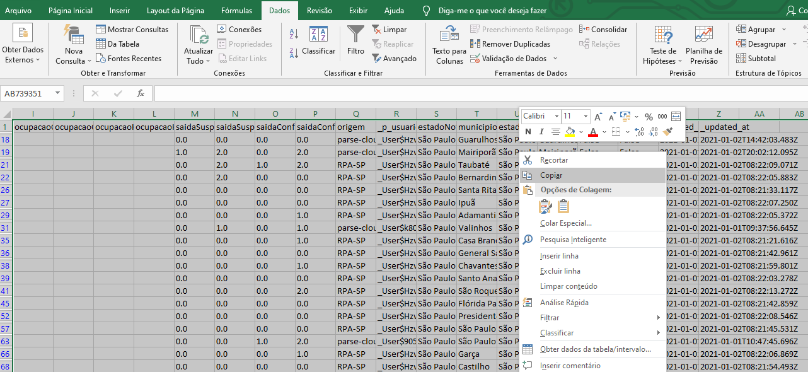
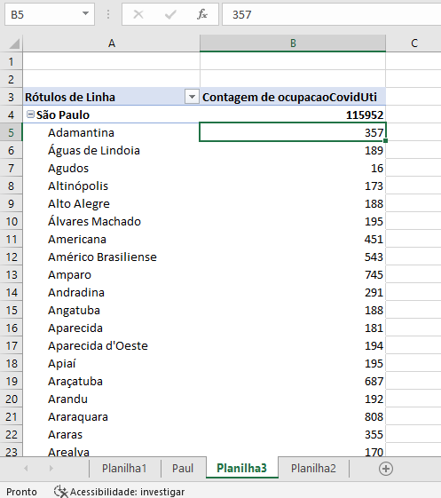
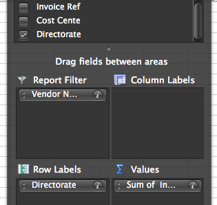
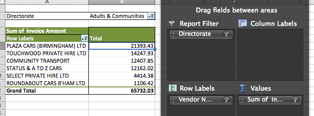

# Obtendo os dados fora

A>***Dany**: Tem um chinês de noventa e cinco libras com cento e sessenta milhões de dólares por trás dessa porta.*
A>
A>***Linus**: Então, vamos tirá-lo daqui.*
A>
A>*Onze Homens E Um Segredo* (Ocean's Eleven)

Agora que ajustamos o filtro avançado para ter resultados mais precisos, você pode usar as mesmas técnicas da tabela dinâmica e ter um panorama disso — o que veremos adiante.

Por enquanto, esses dados são apenas uma parcela de todo o seu conjunto. Com isso, aquelas linhas que não correspondem aos seus critérios permanecem aqui, mas elas estão escondidas. Assim, qualquer tabela dinâmica que criarmos a partir disso vai conter, também, os dados ocultos.

Então, para resolvermos este problema, vamos copiar e colar as novas informações em outra planilha:

*Enquanto os dados são filtrados, use o CTRL+A para selecionar todos (CMD+A no Mac).
*E pressione CTRL+C (CMD+C no Mac) para copiar a seleção — ou, através do botão direito, clique em **Copiar** se você preferir.
*A partir disso, você vai perceber que os dados copiados possuem linhas pontilhadas ao redor deles — isso acontece por que você está apenas escolhendo aquelas informações filtradas, *não* as que ficaram escondidas.

*Agora, basta criar uma planilha para colar esses dados, faça isso por meio do ícone de adição na parte inferior da tela, ou do menu **Inserir**.
*Cole os dados copiados nessa tabela, pressionando CTRL+V (CMD+V no Mac) ou clicando com o botão direito do mouse e selecionando a opção **Colar**.
*Por último, role até o final da página e verifique se ela tem apenas os dados filtrados.

Com isso, você já pode usar essas informações e gerar uma tabela dinâmica inédita, da mesma forma que fizemos com o conjunto inicial. Coloque *Nome do Vendedor* nas linhas, e *Valor da fatura* na área dos dados, por fim, você vai ver um total para cada empresa.

A partir daí, você terá uma lista ainda mais fácil de reduzir. Sendo que, no topo da coluna, contendo os nomes das empresas, haverá uma célula colorida dizendo **Rótulos de Linha**. À direita, está uma seta para baixo que abre um menu suspenso mostrando todos os nomes das companhias. Agora é simples: basta clicar nele e desmarcar todos os nomes que você *não* quer que apareçam nessa tabela dinâmica.

Acima, vemos que ALL SPORTS SCHOOLS COACHING LTD não é uma empresa de transporte, então nós podemos desmarcá-la. Da mesma forma que CENTRAL COACHING AND SPORTS ACADEMY, DOABA TENT HIRE SERVICE, JOHN GALLAGHER SPORT COACHING e assim por diante (estes são apenas alguns exemplos dos meus dados — você pode procurar por alguns que sejam semelhantes em sua tabela).

Outros não serão tão óbvios: como FREIGHT TRANSPORT ASSOCIATION (Associação de Transporte de Carga - tradução livre). Isso seria uma companhia de transporte? Bem, nesse caso, uma rápida pesquisa no Google é o bastante para sabermos se ela é uma empresa, para excluímos ou não.

E que tal FINESSE COACHES LTD? Pode ser uma empresa de coaches independentemente do sentido da palavra, mas nesse caso ela se refere ao tipo de veículo comum no Reino Unido. E, de fato, ao procurar na internet, você pode encontrar um julgamento de inquérito público relacionado à empresa de mesmo nome em Midlands pelo Traffic Commissioner (órgão responsável pela regulamentação e licenciamento daqueles que operam veículos mais pesados na Grã-Bretanha) datado de um ano antes. *Esse ponto em específico* é algo a se prestar atenção — até mesmo com outros nomes da sua planilha. Mas lembre-se de nunca perder o foco: termine seu projeto atual antes de começar outro.

Assim, quando estiver filtrado os nomes que não quer nessa tabela, automaticamente você terá um novo conjunto de dados para usar em ideias futuras. Novamente:

*Quem está recebendo mais dinheiro?
*Quem está gastando mais em transporte?
*Que tipo de empresa está sendo usada?

Lembrando que classificar a coluna B dos maiores para os menores valores mais uma vez traz ao topo o maior destinatário. Por exemplo, nos meus dados há uma empresa de táxis que está recebendo £67,000 apenas neste mês.

E se nós quiséssemos olhar para esse tipo de agente?

Primeiramente, ainda precisamos manter o filtro voltado para os nomes de empresas: assim, vamos arrastar o "Nome do Vendedor" da caixa Linhas para a caixa **Filtros**. Isso vai nos trazer um total geral - e nós ainda podemos arrastar algo novo para Linhas: **Departamentos**.

Suas quatro caixas agora vão se parecer com isto (dependendo, é claro, da sua versão de Excel):

Este passo vai nos ajudar a compreender quem está gastando mais dinheiro e, talvez, em quê as empresas estão direcionando os seus gastos. Ou seja, se a maioria dos pagamentos está sendo feita pelo departamento 'CYPF', por exemplo — basta fazer uma outra pesquisa rápida ou dar um telefonema para saber o que significa 'Children, Young People and Families'(Crianças, Jovens e Famílias). Isso [cobre](http://www.birmingham.gov.uk/cs/Satellite?c=Page&childpagename=Legal-Services%2FPageLayout&cid=1223092568895&pagename=BCC%2FCommon%2FWrapper%2FWrapper) "todas as áreas de negócios relacionadas à educação e cuidado social para crianças e jovens".

Seguindo o raciocínio, esse tipo de investimento  deve incluir veículos de transporte para estudantes, seja para ir à escola como para fazer outras viagens estudantis. Partindo deste ponto, você, também, pode ir além e ver  apenas os gastos feitos por um setor.

Tudo vai depender do que você estiver interessado ou naquilo que é mais noticiável no momento. Por exemplo:

*Se estão acontecendo muitas demissões e um gasto de dinheiro com um quadro temporário de funcionários.
*Caso alguém esteja fazendo declarações acerca do desperdício de dinheiro público, seu departamento está, de fato, agindo corretamente?
*Estão sendo feitas reduções, onde o dinheiro é gasto desnecessariamente? Ou não?
*Quais serão os impactos sentidos a partir de cortes em determinadas áreas?
*Quando um assunto ganha as manchetes, como a obesidade entre os adolescentes ou as estradas que precisam de um reparo, qual é a quantia necessária para resolver estes problemas? Ou, se já houve um esforço em resolver o problema, a situação de fato mudou?

Com certeza, você pode avançar muito mais — à medida que for lendo as notícias, mais ideias surgirão (inclusive, nomes para futuras fontes!).

Para dar um exemplo sem sair dos nossos dados, se você apenas tiver interesse nos gastos feitos por um departamento (vamos usar *Adults and Communities*, Adultos e Comunidades - tradução livre), basta clicar no menu suspenso em **Rótulos de Linhas** e marcar apenas ele. Assim:

*arraste *Departamentos* para a caixa **Filtro**, e
*arraste *Nome do Vendedor* de vola para a caixa **Linhas**

... No fim, você terá algo parecido com:

**Experimente as diferentes combinações de filtros e linhas** e esteja sempre pronto para deixar os dados e partir para uma investigação à parte quando for necessário. Contudo, nunca se esqueça de que essas informações não vão trazer sozinhas tudo aquilo que você precisa.

A>### Técnicas de pesquisa para encontrar dados relacionados
A>
A>Quando os telefonemas não funcionarem, existem outros meios que podem ser úteis na busca de dados extras para o seu texto. **Códigos de custo** são um bom exemplo — *se* você souber ao quê eles se referem. No caso abaixo, cada item possui um código de 'Centro de custo', referente a uma parte mais específica da autoridade do que de um departamento.
A>
A>Portanto, se o seu interesse for um custo com o códigoRBL23, você pode fazer uma pesquisa na internet para ver se ele aparece em algum documento. Os exemplos abaixo podem nortear a sua pesquisa em diferentes caminhos:
A>
A>*Procurando por `RBL23 filetype:xls` no Google, apenas aparecerão tabelas contendo esse código.
A>*Se buscarmos por  `RBL23 filetype:pdf` no Google,vão surgir PDFs com ele.
A>*Por fim, se colocarmos `RBL23 site:birmingham.gov.uk`  no Google, veremos páginas e documentos no “Birmingham council website”.
A>
A>Você, ainda, pode adaptar essas técnicas para outros tipos de documentos (`filetype:doc` para Word, por exemplo) e sites (`site:gov.uk[ou determinada sigla de um país]` para todos os sites do governo). Nisso, os termos  `site:` e `filetype:` são chamados **operadores de pesquisa** — e podem poupar muito tempo nas buscas.
A>
A>Algumas vezes, você encontrará uma tabela ou documento que vai listar todos os códigos e adicionar outras informações. Por exemplo, num resultado em que escolas ou autoridades são representadas por um código: você pode encontrar recursos como [este] (http://www.dwp.gov.uk/docs/faqs-la-code-list.xls) que vai mostrar, também, quem eles são, seus endereços e assim por diante.
A>
A>Já em outras pesquisas, você vai ver documentos — tais como diretrizes, detalhes em pagamentos individuais ou modelos para enviar informações. Todos podem ser úteis se você precisar recorrer à Lei de Acesso à Informação. Já que eles dizem quais são coletadas (ou as que deveriam ser!).
A>
A>Ainda assim, caso você não encontre mais detalhes, tente recorrer novamente ao telefone entrando em contato com a autoridade que divulga os dados — o endereço de contato geralmente está na página em que são publicados. Ou com alguma fonte que te mostre o caminho para chegar a esta pessoa.
A>
A>Se mesmo assim nada adiantar, tente, desta vez, entrar em contato com autoridades da Lei de Acesso à Informação. Pois, eles podem te ajudar caso você precise recorrer a um pedido formal.
A>
A>E, se ambos não puderem ajudar, não encare isso como um fracasso: afinal, você fez dois contatos futuramente promissores!
A>
A>A última opção, portanto, é o requerimento da Lei de Acesso à Informação. Para dar início a esse pedido pela internet, acesse o portal do Serviço de Informação ao Cidadão (SIC), realizar o cadastro se esta for a primeira vez que você utiliza essa ferramenta e registrar o pedido. Você pode utilizar, também, um serviço livre como o [WhatDoTheyKnow](http://whatdotheyknow.com/) ou [AsktheEU](http://www.asktheeu.org/). Nos Estados Unidos, você pode adquirir informações de sites como "Reporters Committee for Freedom of the Press's" [FOIA Letter Generator](http://www.rcfp.org/foia).
A>
A>*A vantagem de serviços como o WhatDoTheyKnow é que eles facilitam o processo de fazer e rastrear solicitações da FOI (The Freedom of Information Act, semelhante à Lei de Acesso à Informação no Brasil) e achar pessoas com um interesse similar ao seu e que podem te ajudar, de alguma forma.
A desvantagem é de que o seu requerimento é público. Portanto, se você quer alguma privacidade isso não será possível.*
A>
A>Mas, lembre-se de que, ao fazer um pedido relacionado aos dados, cheque os seguintes pontos:
A>
A>*Você está solicitando as informações em **formato de planilha digital**(CSV ou XLS)? Se não especificar isto, os dados podem vir no formato PDF ou mesmo impresso no papel, o que pode não ajudar muito.
A>*Pergunte se as **partes diferentes dos códigos possuem significados específicos**. Como, por exemplo, se os primeiros dois personagens podem se referir a um departamento e os próximos três a algo diferente.
A>*Tente pedir um **dicionário dos dados** para o conteúdo em que você estiver trabalhando. Isso vai abranger todos os campos em sua planilha — não somente os que são publicados. Nesse caso, explique detalhadamente o que você está pedindo, pois, eles podem dizer que não sabem o que é, ou que não possuem. Outra opção é solicitar todos os dados, incluindo aqueles que não foram publicados — mantendo em mente o próximo ponto...
A>* **Antecipando quaisquer objeções** que podem ser feitas: É comum leis de acesso à informação preverem casos em que as solicitações podem ser rejeitadas. Entre os argumentos mais comuns para as objeções, estão custos operacionais, privacidade de dados ou de servidores, segredos de Estado ou até confidencialidade comercial. Se você puder se familizar com essas situações, cite-as em seu requerimento. Por exemplo, você pode explicar ao órgão público quais as obrigações dele diante da sua solicitação (como explicar o motivo da negativa ou ajudá-lo a reformular sua solicitação). Você pode, também, moldar seu pedido para excluir informações que se enquadram nas objeções e correm o risco de fazer sua solicitação ser rejeitada.
A>* Lembre-se de que você pode fazer pedidos de **documentos** e de dados: existem documentos que podem ser mais úteis para a sua matéria, como recibos de pagamentos individuais ou reivindicações. Documentos políticos ou de orientação podem se úteis também: por exemplo, em gastos, comissionamento ou reivindicação de dinheiro.
A>
A>Requerimentos como estes podem levar semanas ou ainda meses. Vale a pena fazer esses pedidos e se planejar com antecedência. Assim, você tem um contexto básico de dados já disponível quando os próximos saírem.

